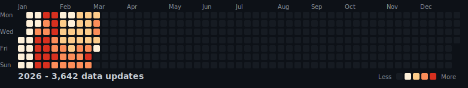
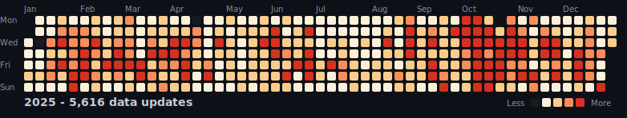
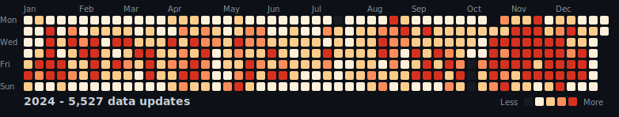
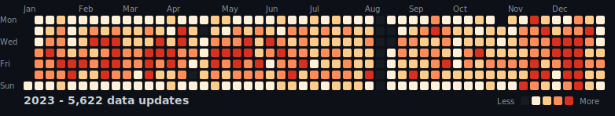
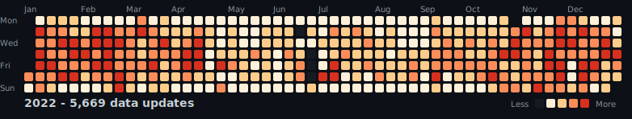
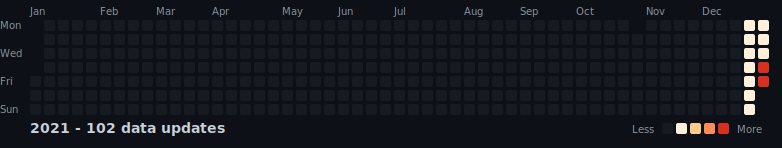

# Termoficare Bucuresti - Flat Data

Automated tracking of Bucharest district heating system status using [GitHub Flat Data](https://githubnext.com/projects/flat-data).

## Data Source

- **URL**: https://www.cmteb.ro/functionare_sistem_termoficare.php
- **Update frequency**: Every 15 minutes
- **Format**: Raw HTML

## Commit Activity

### 2026

### 2025

### 2024

### 2023

### 2022

### 2021

## View Data

Once this repository is made public, use [Flat Viewer](https://flatgithub.com/FlorinPopaCodes/termoficare-data) to browse the data interactively.

## How It Works

This repository uses the [Flat GitHub Action](https://github.com/githubocto/flat) to periodically fetch the heating status page and commit any changes to this repository.
