# Termoficare Bucuresti - Flat Data

Automated tracking of Bucharest district heating system status using [GitHub Flat Data](https://githubnext.com/projects/flat-data).

## Outages

Two utilities are tracked: **heating** (INC) and **domestic hot water** (ACC). Each map covers one year of one utility. Every cell is one day, and its color shows how many outages were active that day: near-black means none were observed, and the yellow-to-red scale deepens as the count rises. The scale is shared across all years of a utility, so equal color means equal severity in any year. Grey cells are days with no usable data — the system's state that day is unknown, which is not the same as a day with zero outages.

### 2026

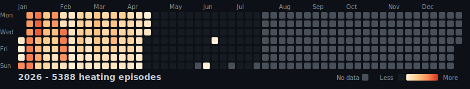

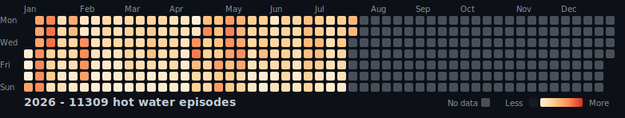

### 2025

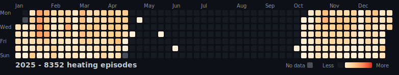

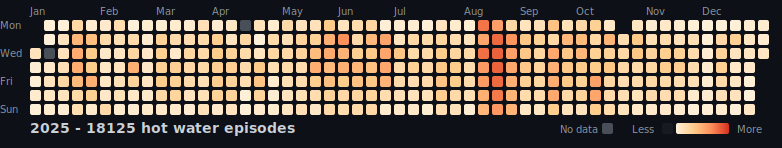

### 2024

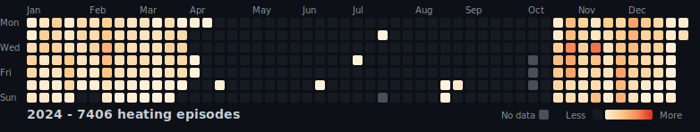

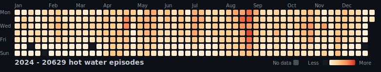

### 2023

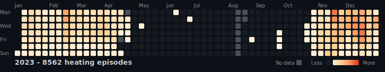

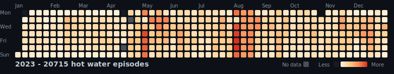

### 2022

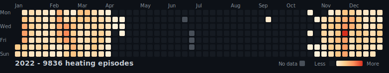

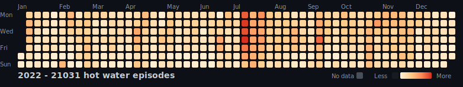

### 2021

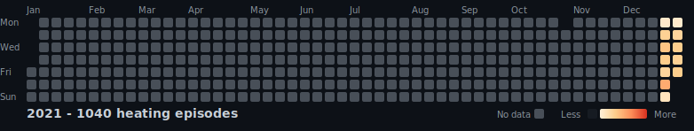

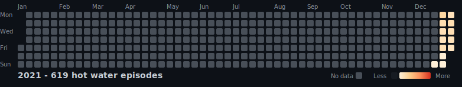

## Estimate reliability

CMTEB posts a restoration estimate for most outages. Each point is the share of the estimates posted that month that were met — restoration observed at or before the estimated time, with no grace period. Hollow points are provisional: some of that month's outages are still running, so the value can move as they resolve (it usually reads high at first, because quickly-fixed outages settle their scores soonest). Months with fewer than 20 scored estimates are not drawn.

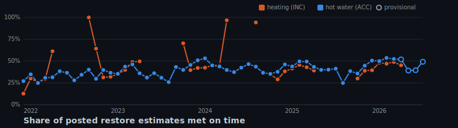

## Outage duration

How long outages last, month by month: the median (p50), p90 and p99 of the durations of outages that began that month, from first sighting to observed restoration. The time scale is logarithmic — typical outages resolve in hours, the worst run for weeks. Hollow points are provisional: some of that month's outages are still running, and the percentiles can still move as those resolve — the still-running outages tend to be the long ones, so the tail is usually understated at first. Months with fewer than 100 closed outages for a utility are not drawn, which is why the heating panel goes quiet each summer.

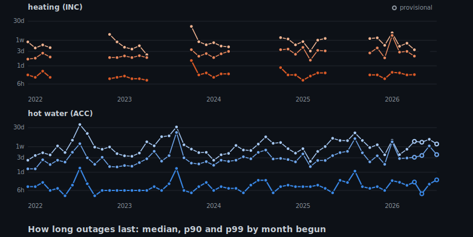

## Data Source

- **URL**: https://www.cmteb.ro/functionare_sistem_termoficare.php
- **Update frequency**: Every 15 minutes
- **Format**: Raw HTML

## Commit Activity

### 2026
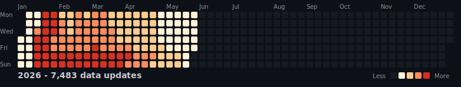

### 2025
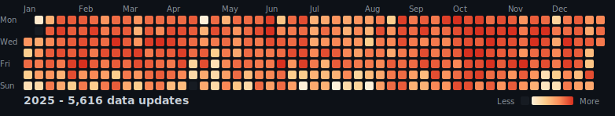

### 2024
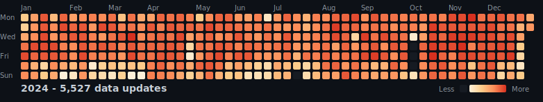

### 2023
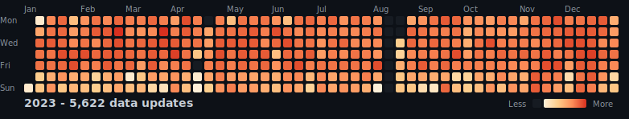

### 2022
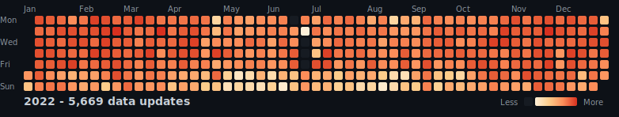

### 2021
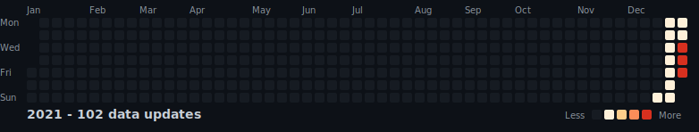

## View Data

Use [Flat Viewer](https://flatgithub.com/FlorinPopaCodes/termoficare-data) to browse the data interactively.

## How It Works

This repository uses the [Flat GitHub Action](https://github.com/githubocto/flat) to periodically fetch the heating status page and commit any changes to this repository.
